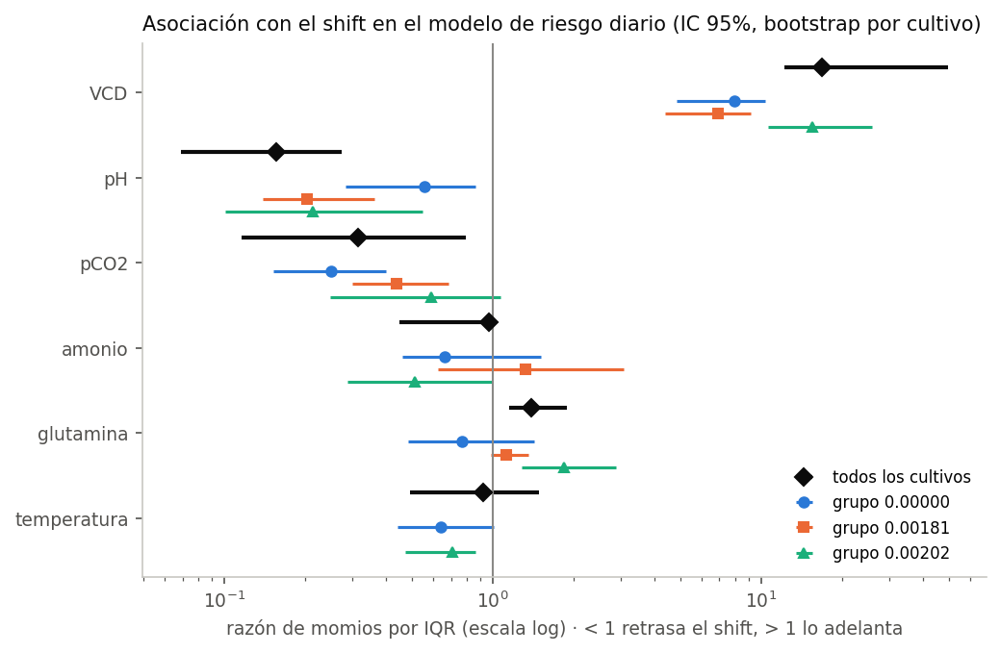
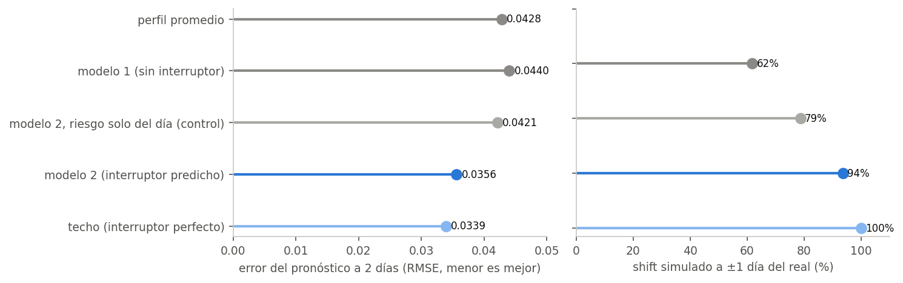

# lactateshift

Desarrollado por Arturo Rodriguez.

Que determina el momento del *lactate shift* en cultivos CHO fed-batch, y
si se puede anticipar con un enfoque interpretable.

El **lactate shift** es el momento en que un cultivo deja de producir lactato
netamente y empieza a consumirlo. La acumulacion de lactato inhibe el
crecimiento y la productividad, asi que entender que adelanta o retrasa el
cambio es util para controlarla.

Este repositorio tiene dos partes:

1. **`lactateshift`**, un paquete de Python que detecta el shift en cualquier
   serie de lactato y construye variables de una ventana temprana sin dejar
   entrar informacion posterior a ella.
2. **`analysis/`**, un caso de estudio sobre 106 cultivos CHO industriales de
   5 a 500 L: una definicion del shift por celula, un modelo de riesgo diario
   y dos modelos mecanisticos del perfil de lactato.

En corto: el momento del shift se asocia sobre todo con el crecimiento
temprano, y ademas con pH y pCO2. Un modelo de riesgo diario sin variables de
lactato anticipa bien los shifts tempranos y mal los tardios. Un modelo de dos
estados, con la transicion dada por ese riesgo, describe el perfil de lactato
mejor que uno sin cambio de estado. Todo son asociaciones en datos
normalizados, con las limitaciones que se detallan abajo.

---

## Instalacion

```bash
git clone https://github.com/zHxise/lactate-shift-cho
cd lactate-shift-cho
pip install -e ".[dev]"        # paquete + tests
pip install -e ".[analysis]"   # + lo necesario para el caso de estudio
```

Requiere Python 3.10 o superior. El paquete depende solo de numpy y pandas.

## Uso

No hace falta ningun dato externo: el paquete genera cultivos sinteticos con
el dia del shift conocido.

```python
from lactateshift import detect_shift, make_synthetic_cultures, detect_shift_batch

# una serie
r = detect_shift(days=[1,2,3,4,5,6,7,8], values=[1,2,4,7,9,6,3,2])
print(r.occurred, r.day)      # True 5.0

# muchas series a la vez, listo para un modelo de supervivencia
series, verdad = make_synthetic_cultures(40, seed=0)
tabla = detect_shift_batch(series, id_col="culture", day_col="day", value_col="lactate")
print(tabla[["occurred", "day", "time"]].head())
```

`time` es el dia del evento cuando ocurrio y el dia de censura cuando no, que
es exactamente lo que piden `lifelines` o `scikit-survival`.

Para probarlo con **tus propios datos**, guarda un CSV con columnas
`culture`, `day` y `lactate` (una fila por cultivo y dia, dias enteros desde 1)
y corre:

```bash
pip install matplotlib          # solo para las figuras
python examples/detectar_en_mi_csv.py examples/ejemplo_cultivos.csv
```

Imprime el dia del shift de cada cultivo y guarda una figura por cultivo con
la curva y el dia marcado. `examples/ejemplo_cultivos.csv` trae cultivos
sinteticos para ver el formato. Acepta tambien el CSV que guarda Excel en
espanol (punto y coma y coma decimal), y si el archivo tiene un problema
(una letra en lugar de un numero, dias repetidos, columnas con otro nombre)
dice cual y en que fila. Tambien avisa si un cultivo tiene una medicion muy
baja y aislada, que podria crear un shift falso (ver Limitaciones).

Variables predictoras de una ventana temprana:

```python
import pandas as pd
from lactateshift import early_window_features

# dos cultivos inventados, en formato largo: una fila por cultivo y dia
datos = pd.DataFrame({
    "culture": ["A"] * 5 + ["B"] * 5,
    "day":     [1, 2, 3, 4, 5] * 2,
    "lactate": [0.5, 1.0, 1.8, 2.6, 3.0,   0.4, 0.7, 1.1, 1.4, 1.6],
    "glucose": [5.0, 4.6, 4.1, 3.5, 3.0,   5.0, 4.8, 4.5, 4.2, 4.0],
    "vcd":     [0.3, 0.6, 1.1, 1.8, 2.4,   0.3, 0.5, 0.8, 1.1, 1.4],
    "scale":   [5] * 5 + [50] * 5,
})

X = early_window_features(
    datos, id_col="culture", day_col="day",
    value_cols=["lactate", "glucose", "vcd"],
    window=4,                          # solo los dias 1 a 4
    ratios=[("lactate", "vcd")],       # cocientes al cierre de la ventana
    static_cols=["scale"],             # constantes conocidas desde el inicio
)
print(X[["lactate_last", "lactate_slope", "lactate_over_vcd", "scale"]])
```

Nada de lo que devuelve depende de un dato posterior al dia 4 ni de otras
series del conjunto. Lo que falta por completo queda `NaN` a proposito: la
imputacion pertenece al pipeline de modelado, donde se ajusta solo con el
fold de entrenamiento.

## Como funciona la deteccion

Hay shift en el primer dia `t` tal que:

1. la derivada de la serie suavizada es negativa durante `n_consecutive` dias
   a partir de `t`, y
2. el valor cae desde `t` al menos `drop_threshold` veces su valor, **antes**
   de que la serie vuelva a superarlo.

La condicion 2, con esa restriccion, descarta las caidas que se recuperan
antes de alcanzar el umbral.

El punto `t` es siempre un **maximo local** de la serie suavizada (en una
meseta, su ultimo punto). No se impone: se sigue de la regla. Si `t`
estuviera en plena bajada, el punto anterior tambien cumpliria las dos
condiciones con una caida mayor y habria sido elegido primero. Hay un test que
lo comprueba sobre cientos de series aleatorias.

**Lo que la regla no hace:** una caida profunda que despues se revierte **si**
cuenta como shift. Es a proposito (en cultivos reales el cambio a consumo
suele ser reversible y el lactato vuelve a subir en fase tardia), pero
significa que la regla detecta *el inicio de un descenso sostenido y profundo*, no *un cambio
de regimen permanente*. Tampoco filtra por amplitud absoluta salvo que se le
pase `min_peak`: sin ese parametro, una serie que oscile cerca de cero puede
producir una caida relativa del 30% que es solo ruido analitico.

**Por que el primer maximo local y no el maximo global.** Una parte de los
cultivos hace el shift, consume lactato varios dias y despues vuelve a
producirlo al final hasta superar el pico inicial. Una regla anclada en el
maximo global marca esos cultivos como "sin shift", lo cual es falso: el shift
ocurrio, solo fue reversible. En el caso de estudio, con los mismos
parametros, la regla del maximo global detecta 76 de 106 cultivos y la del
primer maximo local 101. El problema se encontro al graficar las curvas.

**Correccion del desplazamiento del suavizado.** Una media movil centrada
corre el maximo hacia el lado donde la curva es mas suave. Con
`refine_peak=True` (por omision) el dia se reajusta al maximo de la serie sin
suavizar, dentro de un dia, lo que corrige en cualquiera de los dos sentidos.

- En los cultivos sinteticos de `lactateshift.datasets`, donde el dia real se
  conoce, el sesgo medio pasa de −0.93 a −0.21 dias y los aciertos exactos del
  9.6% al 82.7% (400 cultivos, 10 semillas; detecta el 97.2% de los shifts y
  no da falsos positivos). Con la semilla 1: de −0.91 a −0.18 dias, de 3/34
  a 29/34 aciertos exactos.
- En los datos reales el refinamiento mueve el dia en 40 de 101 cultivos:
  31 hacia atras y 9 hacia adelante.

Los sinteticos tienen una subida que se aplana y una caida brusca, asi que
ahi el suavizado corre el maximo hacia atras. En los cultivos reales pasa lo
contrario con mas frecuencia: la caida suele ser mas lenta que la subida.
**Los sinteticos no reproducen la forma de los cultivos reales**: sirven para
verificar el detector, no para describir cultivos. La validacion sintetica se
reproduce con `python examples/validar_detector_sintetico.py`.

## Validacion externa del detector

¿El detector encuentra el mismo dia que declaran los autores de articulos
publicados? Se probo con 9 curvas de 3 fuentes ajenas al dataset del caso de
estudio (Becker et al. 2019, Yin et al. 2025 y la tesis de Lularevic 2019),
con un protocolo fijado en git antes de buscar datos
(`validacion_externa/PROTOCOLO.md`): detector congelado por su huella,
criterio de exito de al menos 80% de aciertos con tolerancia de un dia, y
commits separados para las curvas, las detecciones y las respuestas de los
autores.

**Resultado: 7 de 9 aciertos (78%, IC 95% 40-97%). No cumple el criterio
fijado de antemano.**

| Lo que declaran los autores | Curvas | Aciertos |
|---|---|---|
| El dia del maximo | 4 | 4, todos en el dia exacto |
| Que no hubo shift | 3 | 3 |
| El inicio del consumo, con una caida suave | 2 | 0 |

Los dos fallos tienen la misma causa: el lactato bajo, pero menos del 30% que
exige la regla (16% en una curva y 25% en la otra, en la serie suavizada). El
detector es conservador: marca los shifts claros en el dia correcto y no marca
los suaves. No se cambio ningun parametro despues de ver esto.

Con 9 curvas el intervalo es ancho, cuatro de ellas vienen de la misma tesis,
y la extraccion no fue ciega: hubo que leer el texto de los autores para saber
si el articulo cumplia los criterios. Detalle, citas y desviaciones en
`validacion_externa/RESULTADO.md`.

## El caso de estudio

**Pregunta:** ¿que determina el momento del lactate shift y el perfil de
lactato en cultivos CHO fed-batch, y se puede anticipar 1-2 dias antes con un
enfoque interpretable?

Dataset: 106 cultivos CHO de AstraZeneca, de 5 a 500 L y 9 a 18 dias, con 24
variables de proceso normalizadas min-max (0-1) sobre todo el conjunto y sin
unidades, del material suplementario de Gangadharan et al. (2021). Se usa la
hoja *Raw Data*: la hoja *Gap-Filled* rellena huecos con informacion de dias
posteriores. **El archivo no se distribuye aqui: esta bajo copyright de
Elsevier.** Ver [`data/raw/README.md`](data/raw/README.md) para obtenerlo,
con verificacion por SHA-256.

```bash
pip install -r requirements-analisis.txt      # versiones fijas del analisis
python analysis/00_verificar_datos.py         # comprueba el archivo
python analysis/10_tasa_especifica.py         # tasa especifica de lactato por celula
python analysis/11_definicion_final.py        # etiqueta del shift (definicion vigente)
python analysis/12_estado_celular.py          # tabla persona-periodo y modelo de riesgo
python analysis/13_asociaciones_por_grupo.py  # asociaciones por grupo de volumen
python analysis/14_modelo_cinetico.py         # modelo cinetico con parametros globales
python analysis/15_correcciones_auditoria.py  # QC de gases, metricas, temperatura
python analysis/16_reversibilidad_glutamina.py
python analysis/17_modelo1_crecimiento.py     # modelo 1: sin interruptor
python analysis/18_modelo2_dos_estados.py     # modelo 2: dos estados
python analysis/19_figuras.py
python docs/verificar_readme.py               # cada cifra del README contra las salidas
```

Los scripts 02 a 09 son la primera version del analisis, con otra definicion
y otra pregunta. Se conservan como registro en
[`docs/caso_estudio_v1.md`](docs/caso_estudio_v1.md).

### Definicion del evento

Esta definicion no es la del paquete `lactateshift`: el paquete trabaja
sobre la concentracion (y es el que se valido externamente); la del caso de
estudio trabaja sobre la tasa por celula y vive en `analysis/10` y `11`.

El shift es **el ultimo dia de produccion neta de lactato por celula**. Para
cada intervalo entre mediciones se calcula la tasa especifica
q = ΔL / IVCD, donde IVCD es la integral de la densidad de celulas viables en
el intervalo. Hay shift cuando q es negativa dos intervalos seguidos y el
lactato suavizado cae al menos 15%; el dia se ajusta al maximo de la serie
cruda, dentro de un dia.

Por que por celula y no por concentracion: la concentracion mezcla cuanto
produce cada celula con cuantas celulas hay. Un cultivo que crece mucho puede
seguir acumulando lactato aunque cada celula ya haya cambiado de regimen.

La tasa no incluye dilucion por alimentacion, porque el regimen de
alimentacion no esta en el dataset. Con una dilucion supuesta de 2% diario,
98 de 100 dias del shift no cambian; con 5%, 90 de 100.

Resultado: **104 cultivos, 100 con shift y 4 censurados**. C33 y C34 se
excluyen porque nunca acumulan lactato. Dia del shift: mediana 6 (15 cultivos
en el dia 4, 21 en el 5, 31 en el 6, 22 en el 7, 6 en el 8, 4 en el 9 y 1 en
el 11).

Control de calidad de gases: las lecturas con pH a mas de 3 rangos
intercuartilicos se enmascaran (pH, pCO2 y pO2 de ese dia). Son 2: C75 dia 2
y C101 dia 1.

### Modelo de riesgo diario

Cada dia en que un cultivo todavia no ha hecho el shift es una fila; el
desenlace es si el shift ocurre ese dia. Una regresion logistica con el dia
como categorias estima la probabilidad diaria. Las variables son las
mediciones del propio dia (VCD, glutamina, glutamato, amonio, pH,
osmolalidad, glucosa, pO2, pCO2), el cambio de VCD y la temperatura.
**Ninguna variable de lactato entra al modelo**, para que no aprenda a
reconocer el shift en la propia curva que lo define. La validacion es
agrupada por cultivo: todas las filas de un cultivo caen en el mismo fold.

| Modelo | AUC fuera de fold |
|---|---|
| Solo el dia | 0.815 |
| Dia + mediciones | **0.942** (IC 95% 0.924-0.960) |

Mejora: +0.127 (IC 95% +0.099 a +0.158, bootstrap por cultivo). Con una
alarma en probabilidad ≥0.5, el modelo marca el dia exacto del shift en 53 de
100 cultivos.

El "solo el dia" es el rival correcto: el riesgo sube con los dias en
cualquier cultivo, y un AUC alto puede venir solo de eso. Contra ese rival,
las mediciones agregan informacion.

Donde funciona y donde no:

| Dia | Eventos | En riesgo | AUC dentro del dia |
|---|---|---|---|
| 4 | 15 | 104 | 0.954 |
| 5 | 21 | 89 | 0.952 |
| 6 | 31 | 68 | 0.875 |
| 7 | 22 | 37 | 0.670 |
| 8 | 6 | 15 | 0.389 |

**Anticipa bien los shifts tempranos y mal los tardios.** El AUC dentro de un
dia compara solo cultivos que siguen en riesgo ese dia, asi que no lo infla
el efecto del calendario.

### Que se asocia con el momento del shift

Razon de momios por rango intercuartilico, modelo conjunto (IC 95% por
bootstrap de cultivos). Una razon mayor que 1 adelanta el shift; menor que 1
lo retrasa.

| Variable | Razon de momios | IC 95% | ¿Se sostiene en los 3 grupos de volumen? |
|---|---|---|---|
| VCD | 16.8 | 12.2-49.6 | Si |
| pH | 0.16 | 0.07-0.27 | Si |
| pCO2 | 0.31 | 0.12-0.79 | En 2 de 3 |
| Glutamina | 1.39 | 1.15-1.90 | No (cambia de signo) |
| Amonio | 0.97 | 0.45-0.99 | No |



- **El crecimiento es la asociacion mas fuerte.** La VCD del dia 3, sola,
  explica R² 0.46 del dia del shift en los 100 cultivos con shift (0.66 en
  los 34 con cambio de temperatura y 0.29 en los 65 sin el).
- **pH y pCO2 mas altos se asocian con un shift mas tardio.** No son un
  reflejo del lactato acumulado (el lactato no entra al modelo), pero el
  dataset no dice que controla el pH (CO2 o base), asi que no se puede
  separar uno de otro.
- **Glutamina y amonio no son robustos.** La glutamina sube con el tiempo en
  la mayoria de los cultivos, que no es el patron de agotamiento tipico (una
  linea GS-CHO lo explicaria, pero es inferencia). Como evento de
  agotamiento, con el umbral fijado solo con datos de entrenamiento, no
  mejora el AUC (diferencia −0.0002, IC −0.0009 a 0.0006) y coincide con el
  shift en 8 de 31 cultivos, al nivel del azar.

Son asociaciones, no causas.

### El cambio de temperatura no explica el momento

Una version anterior de este analisis decia que el shift ocurre casi siempre
junto al cambio de temperatura (36.5 → 33 °C). **No se sostiene.**

- En los 34 cultivos con cambio de temperatura, el shift cae a ±1 dia del
  cambio en el 82%; por azar, permutando, se espera 67% (p = 0.018). Dentro
  de cada grupo de volumen el azar ya da 70% (p = 0.042).
- En esos mismos 34 cultivos, la VCD del dia 3 explica R² 0.663 del dia del
  shift. El dia del cambio de temperatura solo explica 0.261, y al sumarlo a
  la VCD su coeficiente es 0.023 (IC −0.177 a 0.173): no aporta nada.

En este dataset la receta, el crecimiento y el proceso van juntos y no se
pueden separar.

### El shift es reversible

55 de 100 cultivos vuelven a producir lactato de forma sostenida despues del
shift (q positiva dos intervalos y subida ≥15%), con mediana en el dia 12. En
39 de esos 55 la VCD ya esta por debajo del 95% de su maximo: la
re-produccion ocurre sobre todo en el declive del cultivo. Un modelo con un
cambio irreversible describe bien la fase de crecimiento, pero no el cultivo
completo.

### Modelos mecanisticos del perfil de lactato

Dos estructuras, comparadas sobre la misma ventana (hasta que la VCD cae por
debajo del 85% de su maximo), con validacion agrupada por cultivo:

- **Modelo 1, sin interruptor.** El lactato se produce en proporcion al
  crecimiento, modulado por pH y pCO2, y se consume en proporcion al lactato
  y a las celulas:
  ΔL = α·ΔX⁺·(1 + a_p·pH' + a_c·pCO2') + β·IVCD − k·L·IVCD.
  Es la hipotesis nula: no hay un cambio de estado.
- **Modelo 2, dos estados.** La misma cinetica, pero la produccion se apaga
  segun la probabilidad acumulada de haber hecho el shift, F, que sale del
  modelo de riesgo diario ajustado solo con los cultivos de entrenamiento.

En los dos, el parametro de produccion α de cada cultivo se estima con sus
dias 1-4 y se encoge hacia el valor de la poblacion (Bayes empirico).

| Modelo | RMSE del perfil | RMSE a 2 dias | Shift simulado a ±1 dia |
|---|---|---|---|
| Perfil promedio (referencia) | 0.0636 | 0.0428 | - |
| Modelo 1, sin interruptor | 0.0645 | 0.0440 | 62% |
| Modelo 2, riesgo solo del dia (control) | 0.0598 | 0.0421 | 79% |
| **Modelo 2, dos estados** | **0.0509** | **0.0356** | **94%** |
| Modelo 2 con el shift real (techo) | 0.0481 | 0.0339 | 100% |



- El modelo 1 no le gana al perfil promedio.
- El modelo 2 si, y la diferencia a 2 dias contra el modelo 1 es −0.0084
  (IC 95% −0.0102 a −0.0065). Cumple la regla de decision fijada antes de
  correrlo.
- El control alimenta el interruptor con un riesgo que solo conoce el dia.
  La forma de dos estados ayuda algo por si sola (mejor perfil completo y
  79% de shifts a ±1 dia), pero a 2 dias queda practicamente igual que el
  modelo 1 (−0.0019, IC −0.0039 a 0.0001). La ventaja del modelo 2 viene
  sobre todo de las mediciones del cultivo.
- Donde va el pH (en el interruptor o en la cinetica) no se puede decidir:
  las dos variantes dan casi lo mismo (0.0357 y 0.0362 a 2 dias).

**Alcance.** El modelo 2 es explicativo, no un pronostico completo: usa la
VCD medida en todo el horizonte. Para anticipar el perfil en planta habria
que pronosticar tambien el crecimiento. Ademas, el resultado se ve muy bien,
y por eso esta pendiente de una auditoria independiente antes de darlo por
bueno.

## Limitaciones

- **Datos normalizados y sin unidades.** Todo es relativo dentro del
  dataset: no hay umbrales absolutos, y los cocientes entre variables
  normalizadas no tienen sentido fisico. La normalizacion se hizo sobre todo
  el conjunto, una fuga leve e inevitable en el dato de origen.
- **Receta, producto, escala y temperatura estan entrelazados.** No hay llave
  entre las series y la linea celular o el producto, asi que la validacion se
  agrupa por cultivo, no por producto. El desempeno es probablemente
  optimista.
- **104 cultivos heterogeneos.** Cada modelo extra es una oportunidad de
  sobreajuste; por eso las comparaciones se hacen contra rivales fuertes, con
  intervalos por bootstrap de cultivos y reglas de decision fijadas antes.
- **El modelo de riesgo falla en los shifts tardios** (dia 7 en adelante).
- **Sin regimen de alimentacion ni dilucion.** La tasa especifica la ignora;
  es robusta hasta una dilucion de alrededor de 3% diario.
- **Sin marcadores redox** (NAD+/NADH, piruvato): las asociaciones no
  identifican el mecanismo.
- **El fenomeno esta muy estudiado** y su mecanismo sigue en debate (ver,
  entre otros, Schmitt et al. 2019). Esto no es el primer trabajo que modela
  o anticipa el shift en CHO; lo que aporta es una definicion por celula, una
  comparacion honesta entre estructuras mecanisticas y la documentacion de lo
  que no funciono.

## Historia del analisis

La primera version del caso de estudio (scripts 02 a 09) usaba otra
definicion del shift (sobre la concentracion) y otra pregunta (predecir el
dia con los dias 1-4). Esta documentada completa, con lo que no funciono, en
[`docs/caso_estudio_v1.md`](docs/caso_estudio_v1.md). El analisis se reviso
varias veces con auditorias independientes; las correcciones que salieron de
ellas estan en los mensajes de commit y en `analysis/15_correcciones_auditoria.py`.

## Tests

```bash
pytest
```

63 tests, ninguno depende del dataset con copyright: todo lo que
verifican se construye en el momento. Cubren el rebote tardio, la caida
profunda reversible, dias faltantes, NaN internos, entradas invalidas (dias
repetidos, no enteros o en cero), la propiedad de maximo local, el
refinamiento del pico en los dos sentidos, que la cuenta de dias medidos no
incluya los rellenados, que la pendiente use solo mediciones reales, que las
variables no cambien al agregar dias posteriores, que los p-valores nunca
sean cero, que los ejemplos de codigo de este README corran tal cual, y que
el script del CSV explique en espanol lo que esta mal en un archivo, y que los
puntos bajos aislados se senalen sin confundir una bajada real ni el ruido
cerca de cero.

## Cita del dataset

> Gangadharan, N., Turner, R., Field, R., Cheeks, M., Oliver, S.G., Slater,
> N.K.H., Dikicioglu, D. (2021). Data intelligence for process performance
> prediction in biologics manufacturing. *Computers & Chemical Engineering*,
> 146, 107226. https://doi.org/10.1016/j.compchemeng.2021.107226

## Autor

Desarrollado por Arturo Rodriguez (Braulio Arturo Rodriguez Angulo),
Ingenieria Bioquimica, ENCB-IPN.

## Licencia

MIT. El codigo es libre; el dataset del caso de estudio no es mio y no se
redistribuye.
