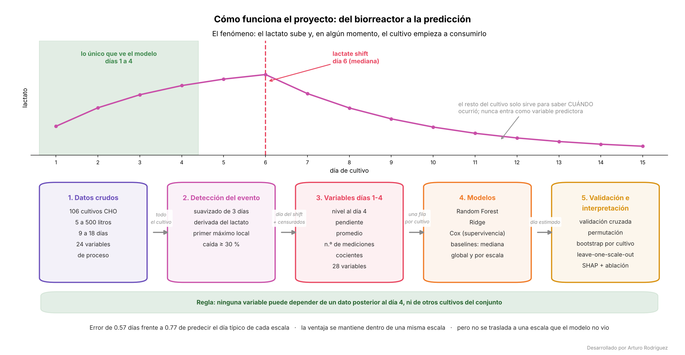

# lactateshift

Desarrollado por Arturo Rodriguez.

Deteccion del *lactate shift* en cultivos de celulas de mamifero, y un caso de
estudio sobre si ese cambio puede anticiparse desde los primeros dias del
cultivo.

El **lactate shift** es el momento en que un cultivo deja de producir lactato
netamente y empieza a consumirlo. Cuando ocurre y que tan sostenido es se
asocia con el desempeno del lote, asi que detectarlo de forma consistente es
un requisito previo para cualquier analisis de proceso que lo involucre.

Este repositorio tiene dos partes:

1. **`lactateshift`**, un paquete de Python que detecta el shift en cualquier
   serie de lactato y construye variables predictoras de una ventana temprana
   sin dejar entrar informacion posterior a ella.
2. **`analysis/`**, un caso de estudio sobre 106 cultivos CHO industriales de
   5 a 500 L, que intenta predecir el dia del shift usando solo los dias 1-4.

El caso de estudio llega a un **resultado mixto**.
Las variables de los dias 1-4 predicen el dia del shift mejor que el dia
tipico de cada escala de reactor, incluso dentro de una misma escala. Pero esa
relacion no se traslada a una escala que el modelo no vio: es especifica de
cada contexto de proceso. Las dos cosas estan documentadas abajo, con los
experimentos que las sostienen.



---

## Instalacion

```bash
git clone https://github.com/zHxise/lactate-shift-cho
cd lactate-shift-cho
pip install -e ".[dev]"        # paquete + tests
pip install -e ".[analysis]"   # + lo necesario para el caso de estudio
```

Requiere Python 3.10 o superior. El paquete depende solo de numpy y pandas.

## Uso

No hace falta ningun dato externo: el paquete genera cultivos sinteticos con
el dia del shift conocido.

```python
from lactateshift import detect_shift, make_synthetic_cultures, detect_shift_batch

# una serie
r = detect_shift(days=[1,2,3,4,5,6,7,8], values=[1,2,4,7,9,6,3,2])
print(r.occurred, r.day)      # True 5.0

# muchas series a la vez, listo para un modelo de supervivencia
series, verdad = make_synthetic_cultures(40, seed=0)
tabla = detect_shift_batch(series, id_col="culture", day_col="day", value_col="lactate")
print(tabla[["occurred", "day", "time"]].head())
```

`time` es el dia del evento cuando ocurrio y el dia de censura cuando no, que
es exactamente lo que piden `lifelines` o `scikit-survival`.

Para probarlo con **tus propios datos**, guarda un CSV con columnas
`culture`, `day` y `lactate` (una fila por cultivo y dia, dias enteros desde 1)
y corre:

```bash
pip install matplotlib          # solo para las figuras
python examples/detectar_en_mi_csv.py examples/ejemplo_cultivos.csv
```

Imprime el dia del shift de cada cultivo y guarda una figura por cultivo con
la curva y el dia marcado. `examples/ejemplo_cultivos.csv` trae cultivos
sinteticos para ver el formato. Acepta tambien el CSV que guarda Excel en
espanol (punto y coma y coma decimal), y si el archivo tiene un problema
(una letra en lugar de un numero, dias repetidos, columnas con otro nombre)
dice cual y en que fila. Tambien avisa si un cultivo tiene una medicion muy
baja y aislada, que podria crear un shift falso (ver Limitaciones).

Variables predictoras de una ventana temprana:

```python
import pandas as pd
from lactateshift import early_window_features

# dos cultivos inventados, en formato largo: una fila por cultivo y dia
datos = pd.DataFrame({
    "culture": ["A"] * 5 + ["B"] * 5,
    "day":     [1, 2, 3, 4, 5] * 2,
    "lactate": [0.5, 1.0, 1.8, 2.6, 3.0,   0.4, 0.7, 1.1, 1.4, 1.6],
    "glucose": [5.0, 4.6, 4.1, 3.5, 3.0,   5.0, 4.8, 4.5, 4.2, 4.0],
    "vcd":     [0.3, 0.6, 1.1, 1.8, 2.4,   0.3, 0.5, 0.8, 1.1, 1.4],
    "scale":   [5] * 5 + [50] * 5,
})

X = early_window_features(
    datos, id_col="culture", day_col="day",
    value_cols=["lactate", "glucose", "vcd"],
    window=4,                          # solo los dias 1 a 4
    ratios=[("lactate", "vcd")],       # cocientes al cierre de la ventana
    static_cols=["scale"],             # constantes conocidas desde el inicio
)
print(X[["lactate_last", "lactate_slope", "lactate_over_vcd", "scale"]])
```

Nada de lo que devuelve depende de un dato posterior al dia 4 ni de otras
series del conjunto. Lo que falta por completo queda `NaN` a proposito: la
imputacion pertenece al pipeline de modelado, donde se ajusta solo con el
fold de entrenamiento.

## Como funciona la deteccion

Hay shift en el primer dia `t` tal que:

1. la derivada de la serie suavizada es negativa durante `n_consecutive` dias
   a partir de `t`, y
2. el valor cae desde `t` al menos `drop_threshold` veces su valor, **antes**
   de que la serie vuelva a superarlo.

La condicion 2, con esa restriccion, descarta las caidas que se recuperan
antes de alcanzar el umbral.

El punto `t` es siempre un **maximo local** de la serie suavizada (en una
meseta, su ultimo punto). No se impone: se sigue de la regla. Si `t`
estuviera en plena bajada, el punto anterior tambien cumpliria las dos
condiciones con una caida mayor y habria sido elegido primero. Hay un test que
lo comprueba sobre cientos de series aleatorias.

**Lo que la regla no hace:** una caida profunda que despues se revierte **si**
cuenta como shift. Es a proposito (en cultivos reales el cambio a consumo
suele ser reversible y el lactato vuelve a subir en fase tardia), pero
significa que la regla detecta *el inicio de un descenso sostenido y profundo*, no *un cambio
de regimen permanente*. Tampoco filtra por amplitud absoluta salvo que se le
pase `min_peak`: sin ese parametro, una serie que oscile cerca de cero puede
producir una caida relativa del 30% que es solo ruido analitico.

**Por que el primer maximo local y no el maximo global.** Una parte de los
cultivos hace el shift, consume lactato varios dias y despues vuelve a
producirlo al final hasta superar el pico inicial. Una regla anclada en el
maximo global marca esos cultivos como "sin shift", lo cual es falso: el shift
ocurrio, solo fue reversible. En el caso de estudio, con los mismos
parametros, la regla del maximo global detecta 76 de 106 cultivos y la del
primer maximo local 101. El problema se encontro al graficar las curvas.

**Correccion del desplazamiento del suavizado.** Una media movil centrada
corre el maximo hacia el lado donde la curva es mas suave. Con
`refine_peak=True` (por omision) el dia se reajusta al maximo de la serie sin
suavizar, dentro de un dia, lo que corrige en cualquiera de los dos sentidos.

- En los cultivos sinteticos de `lactateshift.datasets`, donde el dia real se
  conoce, el sesgo medio pasa de −0.93 a −0.21 dias y los aciertos exactos del
  9.6% al 82.7% (400 cultivos, 10 semillas; detecta el 97.2% de los shifts y
  no da falsos positivos). Con la semilla 1: de −0.91 a −0.18 dias, de 3/34
  a 29/34 aciertos exactos.
- En los datos reales el refinamiento mueve el dia en 40 de 101 cultivos:
  31 hacia atras y 9 hacia adelante.

Los sinteticos tienen una subida que se aplana y una caida brusca, asi que
ahi el suavizado corre el maximo hacia atras. En los cultivos reales pasa lo
contrario con mas frecuencia: la caida suele ser mas lenta que la subida.
**Los sinteticos no reproducen la forma de los cultivos reales**: sirven para
verificar el detector, no para describir cultivos. La validacion sintetica se
reproduce con `python examples/validar_detector_sintetico.py`.

## Validacion externa del detector

¿El detector encuentra el mismo dia que declaran los autores de articulos
publicados? Se probo con 9 curvas de 3 fuentes ajenas al dataset del caso de
estudio (Becker et al. 2019, Yin et al. 2025 y la tesis de Lularevic 2019),
con un protocolo fijado en git antes de buscar datos
(`validacion_externa/PROTOCOLO.md`): detector congelado por su huella,
criterio de exito de al menos 80% de aciertos con tolerancia de un dia, y
commits separados para las curvas, las detecciones y las respuestas de los
autores.

**Resultado: 7 de 9 aciertos (78%, IC 95% 40-97%). No cumple el criterio
fijado de antemano.**

| Lo que declaran los autores | Curvas | Aciertos |
|---|---|---|
| El dia del maximo | 4 | 4, todos en el dia exacto |
| Que no hubo shift | 3 | 3 |
| El inicio del consumo, con una caida suave | 2 | 0 |

Los dos fallos tienen la misma causa: el lactato bajo, pero menos del 30% que
exige la regla (16% en una curva y 25% en la otra, en la serie suavizada). El
detector es conservador: marca los shifts claros en el dia correcto y no marca
los suaves. No se cambio ningun parametro despues de ver esto.

Con 9 curvas el intervalo es ancho, cuatro de ellas vienen de la misma tesis,
y la extraccion no fue ciega: hubo que leer el texto de los autores para saber
si el articulo cumplia los criterios. Detalle, citas y desviaciones en
`validacion_externa/RESULTADO.md`.

## El caso de estudio

Dataset: 106 cultivos CHO de 5 a 500 L, 9 a 18 dias, 24 variables de proceso
normalizadas, del material suplementario de Gangadharan et al. (2021).
**El archivo no se distribuye aqui: esta bajo copyright de Elsevier.** Ver
[`data/raw/README.md`](data/raw/README.md) para obtenerlo, con verificacion
por SHA-256.

```bash
python analysis/00_verificar_datos.py        # comprueba el archivo
python analysis/01_exploracion.py            # estructura, faltantes, cobertura
python analysis/02_definicion_evento.py      # etiqueta + sensibilidad
python analysis/02b_figura_evento.py         # verificacion visual
python analysis/03_features.py               # variables de los dias 1-4
python analysis/04_modelado.py               # regresion, Cox y controles
python analysis/05_shap.py                   # interpretacion y sus limites
python analysis/06_respuesta_auditoria.py    # controles adicionales
python analysis/07_baseline_por_escala.py    # ¿aportan algo las variables por encima de la escala?
python analysis/08_puntos_aislados.py        # ¿alguna etiqueta depende de un error de medicion?
python docs/verificar_readme.py              # cada cifra de este README contra las salidas
```

Todas las cifras de esta seccion se guardan en `outputs/tablas/` y
`docs/verificar_readme.py` comprueba que cada una aparezca aqui tal cual.

### La pregunta que este trabajo responde, y la que no

Con la definicion congelada, **101 de 106 cultivos hacen el shift**. Preguntar
"lo hace o no" da 95 contra 5 y no tiene contenido: lo que varia es **cuando**.
Por eso el problema se planteo como tiempo-a-evento.

Ademas, 16 cultivos hacen el shift **dentro** de la ventana de observacion y se
excluyen: no hay nada que anticipar cuando el desenlace ya esta en las propias
variables. Eso deja **90 cultivos: 85 con evento y 5 censurados**.

Este trabajo **no** responde "se puede predecir el lactate shift en cultivos
CHO". Responde una pregunta condicional:

> Dado un cultivo que **todavia no ha hecho el shift** al cerrar el dia 4,
> ¿que dia lo hara?

Los 16 cultivos excluidos no se predicen. Ademas hay una consecuencia
operativa: **saber que un cultivo pertenece a
esa poblacion requiere informacion posterior al dia 4.** La propia regla
necesita dias siguientes para confirmar que un descenso es sostenido. En una
planta, aplicar este modelo exigiria primero un clasificador para esa
decision, con sus propios errores. Tal como esta, la condicion de entrada es
un oraculo retrospectivo.

Dia del evento: mediana 6, rango 5 a 11 (20 cultivos en el dia 5, 32 en el 6,
22 en el 7, 6 en el 8, 4 en el 9 y 1 en el 11). La anticipacion efectiva
sobre la ventana es de **2 dias en mediana**, y 20 de 85 eventos ocurren a un
solo dia del cierre. Es una anticipacion corta.

### Que salio

Prediccion del dia del evento, error absoluto medio en dias
(validacion cruzada repetida 5×5):

| Variables | Baseline (mediana) | Ridge | Random Forest |
|---|---|---|---|
| Nucleo (28) | 0.835 | 0.613 | **0.571** |
| + glutamina y osmolalidad (36) | 0.835 | 0.650 | 0.578 |
| Solo la escala del reactor (control) | 0.835 | 0.928 | 0.795 |

Glutamina y osmolalidad no aportan: son las variables con mas datos faltantes
en la ventana y las mas imputadas por los autores del dataset.

Prueba de permutacion: se baraja el dia del evento y se repite todo el
procedimiento, seleccion de hiperparametros incluida. El p-valor usa la
correccion (k+1)/(n+1), asi que el menor valor posible depende del numero de
barajadas.

| Modelo | MAE observado | Nulo | p | Barajadas |
|---|---|---|---|---|
| Ridge | 0.625 | 0.934 ± 0.022 | 0.005 | 200 |
| Random Forest | 0.607 | 0.974 ± 0.039 | 0.024 | 40 |

En los dos casos el p es el minimo posible: ninguna barajada igualo al
resultado real.

Modelo de Cox sobre los 90 cultivos, aprovechando los censurados: c-index
0.829, contra un nulo permutado de 0.485 ± 0.051 (p = 0.032, 30 barajadas) y
un control de solo-escala de 0.542. **Es evidencia secundaria y debil**: 74 de
los 85 eventos caen en tres dias y solo hay 5 censurados, asi que el c-index
mide sobre todo la resolucion de empates. No es una confirmacion
independiente del resultado de regresion.

> **Sobre el 0.571.** Es la mejor de nueve combinaciones de modelo y conjunto
> de variables, elegida despues de verlas todas. Sin validacion cruzada
> anidada es una cifra **exploratoria**, no una estimacion confirmatoria de
> desempeno futuro. Lo que si aguanta es el orden: los dos modelos le ganan al
> baseline con los dos conjuntos de variables, y el control de solo-escala no.

### El resultado negativo

Dejando fuera una escala de reactor completa y prediciendo sobre ella:

| Escala excluida | n | Baseline | Ridge | Random Forest |
|---|---|---|---|---|
| 0.00202 | 43 | 1.023 | 0.947 | 1.074 |
| 0.00181 | 18 | 0.778 | 1.375 | 1.552 |
| 0.00000 | 16 | 0.438 | 0.505 | 0.466 |
| **Ponderado** | | **0.844** | 0.955 | 1.059 |

**Ningun modelo le gana al baseline en promedio ponderado.** El Random Forest
lo empeora en las tres escalas. Ridge le gana en una: en la escala de 43
cultivos obtiene 0.947 frente a 1.023 del baseline.

Son **tres** escalas (43, 18 y 16 cultivos), sin intervalos que midan la
variabilidad de excluir una. Lo que los numeros permiten afirmar es que **en
estas tres particiones el modelo no mostro transferencia**, no que no
transfiera en general. Quitar `escala` de las variables no cambia el
resultado (Random Forest 1.062 frente a 1.059), asi que la degradacion no
viene de que el modelo conociera el volumen de la escala nueva.

### ¿Las variables aportan algo por encima de la escala?

La objecion principal al resultado es que predecir el dia del shift podria
ser lo mismo que *aprender a que escala pertenece el cultivo*. El control de
solo-escala ya mostraba que la escala predice por si sola, asi que "predecir
la mediana global" es un baseline debil.

`analysis/07_baseline_por_escala.py` usa un baseline mas fuerte, **predecir
el dia mediano de la propia escala**, que por si solo erra 0.769 dias, y
reporta la incertidumbre con bootstrap sobre cultivos:

| Comparacion | Diferencia (dias) | IC 95% |
|---|---|---|
| Random Forest vs mediana global | +0.265 | [+0.100, +0.423] |
| **Random Forest vs mediana de la escala** | **+0.199** | **[+0.052, +0.349]** |
| Ridge vs mediana global | +0.222 | [+0.066, +0.372] |
| Ridge vs mediana de la escala | +0.156 | [+0.014, +0.298] |

Los dos modelos le ganan al rival fuerte con intervalos que no tocan cero.

La prueba mas directa es trabajar **dentro de una sola escala**, donde el
volumen es constante y no puede explicar nada. En la escala de 43 cultivos:

| Dentro de una escala (n=43) | MAE (dias) |
|---|---|
| Mediana | 0.810 |
| Ridge | 0.736 |
| Random Forest | 0.713 |

Permutando el dia del evento dentro de esa misma escala, el nulo da
0.963 ± 0.062 (p = 0.024, el minimo con 40 barajadas). **Las variables de los
dias 1-4 contienen informacion sobre el dia del shift que la escala no
explica.**

De donde sale la ventaja:

| Dia real | n | Error de la mediana de la escala | Error del Random Forest |
|---|---|---|---|
| 5 | 20 | 1.22 | **0.41** |
| 6 | 32 | 0.49 | 0.56 |
| 7 | 22 | 0.19 | 0.33 |
| 8 | 6 | 1.20 | **0.71** |
| 9 | 4 | 2.50 | **1.70** |
| 11 | 1 | 4.00 | 3.99 |

El modelo no mejora el caso tipico: en los dias 6 y 7 la mediana de la escala
ya acierta y el modelo erra un poco mas. Lo que hace es **distinguir a los
cultivos que cambian antes o despues de lo habitual**, sobre todo los
tempranos del dia 5, donde el error baja de 1.22 a 0.41 dias. Esa es la parte
util de una prediccion temprana: detectar al que se sale del patron.

**Como encaja con el leave-one-scale-out.** Las dos cosas son ciertas a la
vez: dentro de un contexto de proceso, las variables tempranas predicen el dia
del shift mejor que la escala; entre contextos, la relacion no se traslada.
La conclusion que sostienen los datos no es "el modelo solo aprende la escala"
ni "hay una senal fisiologica universal", sino que **la relacion entre las
variables tempranas y el dia del shift existe, pero es especifica de cada
contexto de proceso**.

Lo que esta prueba no resuelve: dentro de una escala todavia puede haber
confusion por linea celular o lote, que el dataset no permite controlar. Y es
una sola escala; la de 18 y la de 16 cultivos son demasiado chicas para
repetirla con potencia.

### Que dice la interpretacion, y que no

Los valores SHAP se calculan **fuera del fold de entrenamiento**: SHAP explica
al modelo, y un modelo sobreajustado da explicaciones nitidas de su propio
sobreajuste. La importancia por SHAP y por permutacion ordenan las variables
casi igual (correlacion de rangos 0.95).

La direccion de los efectos: mas biomasa y crecimiento mas rapido en los dias
1-4, y un lactato mas alto o que sube mas rapido, adelantan el shift. Mas
glutamato, amonio o pH lo retrasan.

Pero la magnitud de la importancia hay que leerla con cuidado.

**Importancia no es necesidad.** El glutamato domina el ranking de SHAP
(0.52 de |SHAP| sumado, contra 0.18 de la siguiente, la glucosa) y tambien
encabeza la importancia por permutacion. Aun asi:

| Conjunto | MAE (dias) |
|---|---|
| Baseline (mediana) | 0.835 |
| Todas las variables | 0.571 |
| Solo glutamato | 0.667 |
| Todas **sin** glutamato | 0.592 |

Quitarlo casi no empeora nada. SHAP y la permutacion miden cuanto **usa** el
modelo una variable, no cuanta informacion **unica** aporta: la del glutamato
tambien esta en las demas, y el modelo la recupera de ahi.

(La variable a quitar se eligio despues de ver los resultados de SHAP, lo que
sesga el experimento, pero a favor de que quitarla empeore el modelo, y no
empeora.)

**Parte de la senal del glutamato es identidad del proceso.** Su grafico de
dependencia no muestra una relacion continua sino dos nubes separadas.
Partiendo la muestra por la mediana de esa variable, el 74% del grupo alto cae
en una sola escala de reactor, y los dos grupos difieren en el dia del evento
(mediana 7 contra 6). La variable funciona en parte como marcador de a que
familia de cultivos pertenece el lote. Eso no contradice la prueba dentro de
escala de la seccion anterior: el glutamato es la variable preferida del
modelo, no la unica fuente de informacion.

### Revision del codigo y del analisis

El codigo y el analisis se revisaron en varias rondas buscando errores.

**Errores encontrados y corregidos:**

1. `<col>_n` contaba como medidos los dias rellenados. Habia un test que
   afirmaba ese comportamiento.
2. La prueba de permutacion congelaba un `alpha` de Ridge elegido con las
   etiquetas reales, lo que sesgaba el p-valor a favor del resultado.
3. SHAP agrupaba lactato/glucosa y lactato/VCD en una sola categoria.
4. Este README afirmaba que ningun modelo le ganaba al baseline al cambiar de
   escala; Ridge si le gana en una de las tres.
5. Los experimentos de sensibilidad corrian con 27 variables en vez de 28.
6. Una correlacion reportada (0.78) era de una corrida anterior.
7. La permutacion solo cubria Ridge mientras se destacaba la cifra del Random
   Forest.
8. Las direcciones de SHAP se calculaban contra valores sin imputar.
9. El baseline de mediana global era un rival demasiado debil (ver la
   seccion anterior). Un primer intento de medir la incertidumbre contra el
   rival fuerte usaba un intervalo mal construido y se corrigio antes de
   reportarlo.
10. La pendiente y el promedio de la ventana se calculaban incluyendo los dias
    rellenados, que no son mediciones. Ahora usan solo los dias medidos.
11. Los p-valores podian salir exactamente 0. Ahora usan (k+1)/(n+1).
12. La explicacion de `refine_peak` suponia que el suavizado corre el maximo
    hacia atras; en los datos reales lo corre mas a menudo hacia adelante.

**Objeciones que resultaron incorrectas al verificarlas:** que la permutacion
de Cox rompia el par (tiempo, evento), y que el detector no garantizaba un
maximo local. La segunda se habia aceptado con una verificacion mal hecha
(comparaba el dia ya refinado, no el punto detectado) y se retiro despues. La
opcion que se habia agregado para "corregirla" hacia que las mesetas no se
detectaran nunca, y se elimino.

**Controles adicionales** (`analysis/06_respuesta_auditoria.py` y
`analysis/07_baseline_por_escala.py`):

*¿El modelo solo extrapola la curva de lactato que ya empezo?*

| Conjunto | MAE (dias) |
|---|---|
| Baseline | 0.835 |
| Todas (28 variables) | 0.571 |
| Solo variables de lactato (6) | 0.684 |
| **Sin ninguna variable de lactato (22)** | **0.593** |

El desempeno no depende de las variables explicitas de lactato. No demuestra
que el modelo ignore la trayectoria del lactato: glucosa, VCD y amonio son
proxies mecanicos de ella.

*¿Las conclusiones dependen de la definicion del evento?* Con ocho
definiciones alternativas, cada una contra su propio baseline, la mejora es
positiva en todas: entre 0.184 y 0.252 dias (mediana 0.237), incluida la
variante sin `refine_peak`, que excluye 6 cultivos en vez de 16 (mejora
0.239). Las ocho son variaciones de la **misma familia de regla**: respaldan
estabilidad ante sus parametros, no robustez ante una definicion
estructuralmente distinta.

## Limitaciones

- **El alcance es condicional**: cultivos que no han hecho el shift al cerrar
  el dia 4. Los 16 excluidos no se predicen, y saber si un cultivo pertenece
  a esa poblacion requiere informacion posterior al dia 4.
- **La relacion no se traslada entre escalas** en las tres evaluadas.
- **La senal dentro de escala se probo en una sola escala** (43 cultivos), y
  dentro de ella puede haber confusion por linea celular o lote.
- **El 0.571 es una cifra seleccionada** entre nueve combinaciones, sin
  validacion cruzada anidada. Exploratoria, no confirmatoria.
- **La regla no distingue un cambio de regimen permanente de una caida
  profunda reversible**, y sin `min_peak` no filtra por amplitud absoluta.
- **Un solo punto muy bajo cerca del final puede crear un shift falso.** La
  media de 3 dias no lo anula en el borde de la serie. Lo encontro una prueba
  con datos inventados (una meseta con un 0.7 entre 3.2 y 4.3). En el caso de
  estudio se reviso con `analysis/08_puntos_aislados.py`: 16 de 106 cultivos
  tienen un punto bajo aislado y quitarlo no cambia el resultado de ninguno.
  `lactateshift.isolated_low_points` y el script del CSV senalan esos puntos
  para revisarlos; el detector no se modifico.
- **El detector no marca los shifts suaves.** En la validacion externa fallo
  en las 2 curvas donde el lactato bajo menos del 30%. En el caso de estudio,
  los 5 cultivos censurados pueden incluir shifts de ese tipo.
- **Los datos sinteticos no reproducen la forma de los cultivos reales**:
  validan el mecanismo del detector, no su adecuacion a cultivos reales.
- **El experimento "sin lactato" no descarta los proxies** (glucosa, VCD,
  amonio) del mismo estado glucolitico.
- **Las ocho definiciones alternativas pertenecen a la misma familia de
  regla**: falta contrastar con un metodo estructuralmente distinto, como la
  deteccion de puntos de cambio.
- **La imputacion del dataset de origen no es causal.** Los autores rellenaron
  huecos con interpolacion de Stineman mas SVR sobre series completas, que usa
  el punto posterior. Por eso todo el analisis parte de la hoja sin rellenar.
- **No se puede agrupar la validacion por linea celular.** El dataset trae
  linea celular y lote para 45 cultivos, pero sin llave a las series de
  tiempo. El desempeno reportado es probablemente optimista.
- **Los datos vienen normalizados 0-1 por columna sobre todo el conjunto**:
  una fuga leve e inevitable en el dato de origen.
- **El c-index de Cox convive con empates masivos** y solo 5 censurados.
- **Sin marcadores redox** (NAD+, piruvato): asociacion, no mecanismo.
- **El muestreo esparso degrada la precision del dia.** Con 30% de dias
  ausentes el error en el dia detectado puede llegar a 2 dias.
- El fenomeno esta muy estudiado y su mecanismo sigue en debate. Esto no es el
  primer trabajo que predice comportamiento de lactato en CHO; lo que aporta
  es una deteccion auditable y una validacion que incluye lo que no funciono.

## Tests

```bash
pytest
```

63 tests, ninguno depende del dataset con copyright: todo lo que
verifican se construye en el momento. Cubren el rebote tardio, la caida
profunda reversible, dias faltantes, NaN internos, entradas invalidas (dias
repetidos, no enteros o en cero), la propiedad de maximo local, el
refinamiento del pico en los dos sentidos, que la cuenta de dias medidos no
incluya los rellenados, que la pendiente use solo mediciones reales, que las
variables no cambien al agregar dias posteriores, que los p-valores nunca
sean cero, que los ejemplos de codigo de este README corran tal cual, y que
el script del CSV explique en espanol lo que esta mal en un archivo, y que los
puntos bajos aislados se senalen sin confundir una bajada real ni el ruido
cerca de cero.

## Cita del dataset

> Gangadharan, N., Turner, R., Field, R., Cheeks, M., Oliver, S.G., Slater,
> N.K.H., Dikicioglu, D. (2021). Data intelligence for process performance
> prediction in biologics manufacturing. *Computers & Chemical Engineering*,
> 146, 107226. https://doi.org/10.1016/j.compchemeng.2021.107226

## Autor

Desarrollado por Arturo Rodriguez (Braulio Arturo Rodriguez Angulo),
Ingenieria Bioquimica, ENCB-IPN.

## Licencia

MIT. El codigo es libre; el dataset del caso de estudio no es mio y no se
redistribuye.
